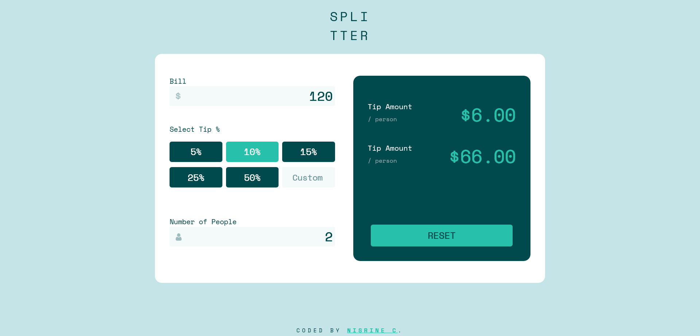

# Frontend Mentor - Tip calculator app solution

This is a solution to the [Tip calculator app challenge on Frontend Mentor](https://www.frontendmentor.io/challenges/tip-calculator-app-ugJNGbJUX). 

## Table of contents

- [Overview](#overview)
  - [Screenshot](#screenshot)
  - [Links](#links)
- [My process](#my-process)
  - [Built with](#built-with)
  - [Useful resources](#useful-resources)
- [Author](#author)

## Overview

### Screenshot

### Links

- Solution URL: [solution URL](https://your-solution-url.com)
- Live Site URL: [live site URL](https://your-live-site-url.com)

## My process

### Built with

- Semantic HTML5 markup
- CSS custom properties
- Flexbox
- CSS Grid

### Useful resources

- [resource 1](https://www.w3schools.com/howto/howto_css_center-vertical.asp) - This helped me center my div both horizontally and vertically
- [resource 2](https://www.geeksforgeeks.org/css-to-put-icon-inside-an-input-element-in-a-form/) - This helped put icons inside my input fields as shown in the design.

## Author

- Website - [Nisrine C](https://www.your-site.com)
- Frontend Mentor - [@Nisrine-C](https://www.frontendmentor.io/profile/yourusername)

